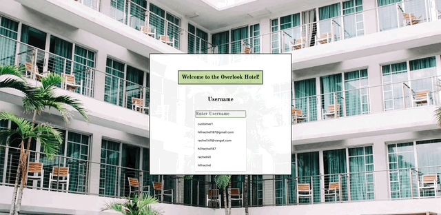

# The Overlook Hotel

## Author

[Rachel Hill](https://github.com/rachellhill)

## Overview

The Overlook Hotel is an application that allows users to login to the hotel's website, view their bookings/reservations, view rooms available upon selecting a date, and book a new reservation all in one user interface.

This application was created by Rachel Hill during her second module of the front-end Engineering program at Turing School of Software and Design. The spec for this project can be found [here](https://frontend.turing.edu/projects/overlook.html).

## How to Use

To access the application locally:
- Clone this repository to your local machine
- Type `cd` into the application
- Run `npm install` to run the local serve to see the HTML page
  - Paste `http://localhost:8080/` into your browser to view the HTML page
  - When you would like to stop running the local server, press control + c in your terminal
- To view tests, run `npm test`
- In addition to cloning down this application's repo, you will also need to clone down this [repository](https://github.com/turingschool-examples/overlook-api) in your terminal to have this server running in addition to the one above.
  - Once cloned, run `npm install` and `npm start`

## Application in Action

- Start by logging in to your account using the username `customer10` and password `overlook2021`
- Once logged in, navigate to the middle section titled Your Reservations to view all of your reservations, most recent bookings at the top.
- If you'd like to book another room, select a date in the Book Your Next Stay box to the left and click `Find Available Rooms`

- Browse through the available rooms and filter as needed. Once you find a desired room, click on it to view booking details.
- If all looks great, click `Confirm Booking` to purchase. This reservation will populate at the top of your reservation list and add to your total cost.

### Technologies Used

- JavaScript
- CSS
- HTML
- Test Driven Development using Mocha & Chai

## Challenges and Wins
- First solo experience building functionality by fetching and posting APIs to access remote roomData
- An important challenge but overall a win was being comfortable / knowing when to reach out for help. A huge part of this role as a developer is having the confidence to ask questions and ask for help
